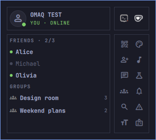

# Install, update, or remove OmaQ

This guide covers source installation, shell-off updates, helper status, rollback, removal, retained data, and optional package cleanup.

[](images/guide/01-panel-home.png)

## Install OmaQ

Arch User Repository (AUR) packaging remains paused. Install the required packages, add the plugin while disabled, build the local helper, and then enable it:

```bash
omarchy pkg add \
  toxcore libsignal-protocol-c libpulse libpng libjpeg-turbo libwebp \
  ttf-material-symbols-variable qrencode &&
omarchy plugin add \
  https://github.com/HANCORE-linux/OmaQ.git --yes &&
make -C ~/.config/omarchy/plugins/hancore.omaq helper &&
omarchy plugin enable hancore.omaq
```

The repository does not contain a generated `helper/omaq` binary. Keep the plugin disabled during the build so the generated binary is not written into an active monitored plugin tree. The local build requires Signal support and refuses direct plaintext fallback.

Verify the plugin and helper after installation:

```bash
omarchy plugin validate ~/.config/omarchy/plugins/hancore.omaq
~/.config/omarchy/plugins/hancore.omaq/scripts/update-helper.sh --status
```

## Update OmaQ

The supported updater keeps every source fetch and helper build outside the monitored plugin directory. Run it from an installation that already contains the command:

```bash
~/.config/omarchy/plugins/hancore.omaq/scripts/update-omaq.sh --yes
```

The update requires an enabled OmaQ plugin, a clean Git checkout on `main`, the canonical OmaQ `origin`, an unlocked session, and a running Protocol-9-or-newer helper. `XDG_RUNTIME_DIR` and `XDG_STATE_HOME` must resolve outside `~/.config/omarchy/plugins/`. The updater refuses symlinked roots, local source changes, non-fast-forward history, malformed manifests, ambiguous protocol declarations, and a staged QML requirement newer than the running helper.

### Bootstrap an older installation

Installations that predate `update-omaq.sh` can run the controller from an external canonical clone. This bootstrap does not modify the live plugin before the controller stops the shell:

```bash
(
  set -euo pipefail; umask 077
  state_home=${XDG_STATE_HOME:-$HOME/.local/state}
  case "$state_home" in
    /*) ;;
    *) echo "State staging path must be absolute" >&2; exit 1 ;;
  esac
  plugins=$(/usr/bin/realpath -m -- "$HOME/.config/omarchy/plugins")
  state_home=$(/usr/bin/realpath -m -- "$state_home")
  case "$state_home/" in
    "$plugins/"*) echo "State staging is inside the plugin tree" >&2; exit 1 ;;
  esac
  bootstrap=$(/usr/bin/mktemp -d \
    "$state_home/omaq-update-bootstrap.XXXXXX")
  trap '/usr/bin/rm -rf -- "$bootstrap"' EXIT
  /usr/bin/env -i HOME="$HOME" PATH=/usr/bin:/bin \
    GIT_CONFIG_GLOBAL=/dev/null GIT_CONFIG_NOSYSTEM=1 \
    GIT_TERMINAL_PROMPT=0 \
    /usr/bin/git -c core.hooksPath=/dev/null -c http.sslVerify=true \
      -c http.followRedirects=initial -c protocol.file.allow=never \
      clone --branch main --single-branch -- \
      https://github.com/HANCORE-linux/OmaQ.git "$bootstrap"
  /usr/bin/env -i HOME="$HOME" PATH=/usr/bin:/bin \
    /usr/bin/omarchy plugin validate "$bootstrap"
  "$bootstrap/scripts/update-omaq.sh" --yes
)
```

To bind an announced release or reviewed revision, add `--expect-commit` followed by its complete lowercase 40-character commit hash. The updater aborts if canonical `origin/main` differs.

### Understand the shell-off sequence

The updater performs these steps in order:

1. Lock source updates outside the replaceable plugin tree.
2. Copy the controller's hardened `helper-runtime.py` into the private runtime lock directory so a tree exchange cannot replace it.
3. Bind the clean live checkout, canonical `origin`, running helper identity, protocol marker, and hashes.
4. Clone the complete `main` checkout, including `.git`, below `~/.local/state/omaq-source-updates/`.
5. Validate the staged plugin, build its helper, validate it again, and bind the commit and helper SHA-256.
6. Refuse a locked session, stop Quickshell, then terminate the exact `omarchy-launch-shell` supervisor if it remains in backoff.
7. Verify that the supervisor, Quickshell, plugin watcher, and shell IPC are all absent.
8. Back up the running `/proc/<pid>/exe` image through the bound runtime tool.
9. Repeat the stopped-state check and exchange the staged and live directories with `mv -T --exchange --no-copy`.
10. Validate the live plugin and create `helper/omaq.prev` from the still-running old image.
11. Start the shell and bind its supervisor PID, Quickshell PID, start times, parent relationship, and session path through every consumer check.
12. Require `listPlugins`, the `hancore.omaq` IPC target, running and available helper hashes, protocol compatibility, and the correlated shell journal to pass.
13. Activate the new helper through `helper-runtime.py --expect-sha256`.
14. Recheck the bound shell plus the running helper hash and protocol; an inactive or incompatible replacement fails the update.

The exchange requires one filesystem and never falls back to a copy. Clone and build monitoring enforce 50,000 entries, 512 MiB per tree, 2 GiB across retained update trees, and at least 1 GiB free before acquisition. A limit or timeout terminates the complete staging process group. OmaQ keeps at most eight staged or previous trees before requiring manual inspection and cleanup.

The old complete Git checkout moves to the external path printed as `previous tree`. OmaQ retains that directory for inspection; it does not delete source backups automatically.

The final process check detects a cooperative restart before the exchange and aborts without renaming either tree. Another process running as the same user remains inside OmaQ's documented trust boundary. Do not run `omarchy restart shell` concurrently with an update.

### Check update status

After the command finishes, check NetworkManager and the helper state:

```bash
nmcli -t -f STATE general
~/.config/omarchy/plugins/hancore.omaq/scripts/update-helper.sh --status
```

The helper status reports one of these states:

- **Current**: the running and available helper hashes match
- **Update pending**: the running and available helper hashes differ
- **Inactive**: no helper is running; the next Service start uses the available binary

### Understand activation outcomes

Use the activation result to choose the next step:

| Result | Meaning | Next step |
|---|---|---|
| `activated` | The group-free replacement passed hash and process verification | Continue with the final checks |
| `current` | The running and available helper already match | Continue with the final checks |
| `update-pending: old helper, new tree` with `active_groups` | Private groups keep the old helper running under the new compatible QML tree | Leave every private group, then rerun the updater |
| `update-pending: old helper, new tree` with `group_state_uncertain` | The helper cannot prove group-free state | Resolve the reported state, then rerun the updater |
| `update-pending: old helper, new tree` with `activation_unsupported` | The helper cannot perform correlated safe shutdown | Use a later full user-session restart |
| `degraded` | Replacement verification failed after the new tree passed consumer checks | Run the helper rollback below |

Pending outcomes return success because the running helper remains unchanged. Protocol capability gating permits this mixed state only when the staged QML requirement does not exceed the running helper protocol.

### Recover from an update failure

A staged build or pre-exchange check leaves the live tree unchanged. A post-exchange schema, shell, plugin, IPC, or helper-consumer failure stops the shell and exchanges the retained old tree back before helper activation. The command returns an error and states whether automatic restoration passed.

The final activation check can fail after the new tree passed its pre-activation consumer checks. The updater leaves that tree in place because the helper process may already have changed, returns a failure, and never treats an inactive helper as success. Check helper status first. Restore `.prev` if the hashes differ or the error reports an inactive, substituted, protocol-incompatible, or degraded helper:

```bash
~/.config/omarchy/plugins/hancore.omaq/scripts/update-omaq.sh \
  --rollback-helper --yes
```

The rollback uses `helper-runtime.py restore`, starts the shell, repeats the consumer checks, and activates the restored hash through the same group-safe operation. It never writes `helper/omaq` while the plugin watcher is running.

<details>
<summary>How group-safe helper activation works</summary>

Before the directory exchange, the runtime doctor copies the verified running `/proc/<pid>/exe` image to the old tree's `helper/omaq.prev`. After the exchange, it copies that same bound image into the new tree's `.prev`. The available helper remains the externally built staging image.

Activation sends only `helper.shutdown_if_no_groups`. The helper confirms durable group-free state before stopping. Service starts the available binary, and the updater verifies its hash, executable identity, protocol marker, and correlated probe. A pre-existing `.prev` does not participate in activation; only `restore` reads it.

A group-free restart creates a short offline window. In-flight messages become `delivery_unknown`, while active transfers, calls, and invitations fail visibly. The workflow has no signal fallback, binary hot-swap, or crash journal.

</details>

## Remove OmaQ

Run the verified wrapper:

```bash
~/.config/omarchy/plugins/hancore.omaq/scripts/uninstall-omaq.sh
```

When a helper is running, the wrapper binds it to its process, executable, socket, and instance. It removes the plugin only after a correlated group-free shutdown acknowledgment and never uses a signal fallback. When no helper runtime exists, it locks helper startup before removal instead.

Removal stops when any of these conditions applies:

- an active private group exists
- native and registered group state disagree
- group cleanup or identity loading remains pending
- runtime identity or the correlated acknowledgment cannot be verified
- helper startup overlaps removal

Omarchy deletes a Git-managed plugin directory, including local source changes inside it. A plain plugin directory is moved to the exact hidden backup path printed by the wrapper. Review or copy any source changes before removal.

## Review retained data

Plugin removal intentionally retains these locations:

- `~/.local/share/omaq/`: identity, contacts, groups, avatars, history, Ratchet state, and managed custom sounds
- `~/.local/state/omaq/`: identity recovery, preferences, unread state, receipts, surfaces, and journals
- `~/Downloads/omaq/`: received files
- `~/.local/state/omaq-deploy-backups/`: deployment backups, when present
- the exact Omarchy plugin backup path printed by the wrapper, when present

Keep retained data if you may reinstall OmaQ or still need the identity or history. Inspect every path before deleting it:

```bash
rm -rf -- "$HOME/.local/share/omaq"                 # Identity and chats
rm -rf -- "$HOME/.local/state/omaq"                 # Preferences and state
rm -rf -- "$HOME/Downloads/omaq"                    # Received files
rm -rf -- "$HOME/.local/state/omaq-deploy-backups"  # Deployment backups
```

Each deletion is irreversible. Run only the individual commands for data you intend to erase.

## Remove unused packages

OmaQ leaves dependency packages installed because another application may use them. This includes `toxcore`, `libsignal-protocol-c`, `libpulse`, `libpng`, `libjpeg-turbo`, `libwebp`, `ttf-material-symbols-variable`, and `qrencode`.

The optional `zbar` verification package also remains when installed for testing. Inspect each package with `pacman -Qi` before removing it. The wrapper prints one combined `omarchy pkg drop` command; edit that command to include only dependencies confirmed unused.
