# Illustrated user guide

This visual guide covers the complete OmaQ workflow: connect with trusted people, use DirectChat and GroupChat, exchange files, manage notifications, protect your identity, and recover safely from interrupted state changes. Click any screenshot to open its full-size original.

## Understand OmaQ security


OmaQ has no accounts, central chat server, or project-operated infrastructure. The local `helper/omaq` process connects to public Tox bootstrap and Transmission Control Protocol (TCP) relay nodes run by community volunteers. Those nodes help clients discover the network and forward encrypted packets, but they cannot read message contents.

Direct messages add the Signal Double Ratchet to Tox transport and never fall back to plaintext. OmaQ disables direct User Datagram Protocol (UDP) discovery and hole punching, so contacts do not receive each other's IP addresses. Tox relay operators can still observe ordinary connection metadata.

Your identity, contacts, Ratchet state, preferences, and history remain on your machine. Use OmaQ only for lawful private communication with people you trust.

## Open the panel and respond to requests

The fixed panel header normally shows your avatar, nickname, and connection state. A pending friend or group request temporarily replaces the complete self presentation until you accept or decline it.

Hover or keyboard-focus an action-rail icon to display its label. Use the rail to open these functions:

- **Invite**, **Add contact**, and **Open chat** for direct connections
- **Groups** and **Search and safety** for existing conversations
- **Chat message size**, **Theme**, and **Sounds** for presentation
- **Demo** to test the composer without sending
- **Mute** or **Unmute** to control notification sound
- **Danger zone** and **Identity** for protected state changes

<table>
<thead><tr><th>Panel home</th><th>Friend request</th><th>Group invitation</th><th>Open a chat</th></tr></thead>
<tbody><tr>
<td><a href="images/guide/01-panel-home.png"></a><br>Your identity, connection state, friends, groups, support links, and action rail share one compact panel.</td>
<td><a href="images/guide/02-panel-friend-request.png">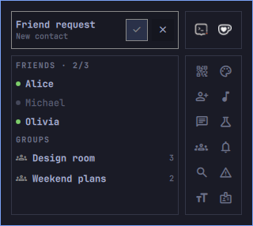</a><br>A friend request hides the self content and presents clear Accept and Decline actions.</td>
<td><a href="images/guide/03-panel-group-invite.png">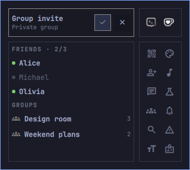</a><br>A private group invitation uses the same focused decision layout.</td>
<td><a href="images/guide/06-panel-open-chat.png">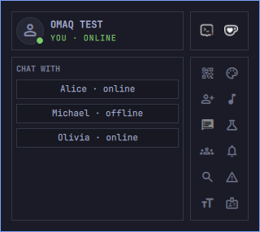</a><br>Select an accepted contact to open the matching stable DirectChat window.</td>
</tr></tbody>
</table>

Close the panel with `Escape`, another press on the OmaQ bar action, or a click outside. The panel intentionally has no redundant Close button and never keeps a desktop-sized invisible input region.

Friend names show online, away, and offline state. An unread friend receives a `color03` underline, while the bar widget shows the total unread badge when badges are enabled.

## Create and redeem invitations

A direct connection starts with a one-use `omaq://` invitation shared through a trusted channel. The person who created the invitation must explicitly accept the incoming friend request.

<table>
<thead><tr><th>Create an invitation</th><th>Redeem an invitation</th><th>Search and verify</th><th>Incoming call</th></tr></thead>
<tbody><tr>
<td><a href="images/guide/04-panel-active-invite.png">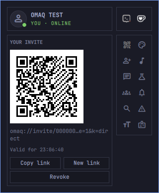</a><br>The Invite view shows a QR code, shortened link, exact lifetime, Copy link, New link, and Revoke.</td>
<td><a href="images/guide/05-panel-add-contact.png">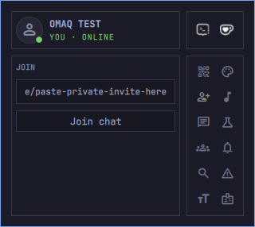</a><br>Paste the complete private invitation and select Join chat. Invalid, expired, self, duplicate, and changed-identity invitations fail visibly.</td>
<td><a href="images/guide/10-panel-search-safety.png">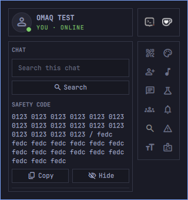</a><br>Search one selected DirectChat or display its safety code. Compare the code with that contact through another trusted channel.</td>
<td><a href="images/guide/27-panel-incoming-call.png">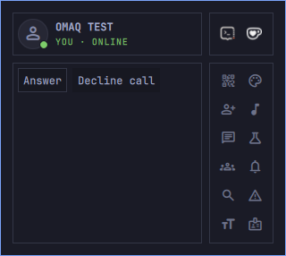</a><br>An incoming DirectCall offers Answer and Decline. Opening the caller's chat never answers automatically.</td>
</tr></tbody>
</table>

Connect two people in this order:

1. Select **Invite** and share the complete link or QR code through a trusted channel.
2. On the other device, select **Add contact**, paste the invitation, and select **Join chat**.
3. On the first device, verify the requester and select **Accept**.
4. Select **Search and safety**, choose that contact, and compare **Show safety code** through another trusted channel.

A new link expires 24 hours after the helper issues it. **New link** first revokes the previous link, then creates its replacement. **Revoke** invalidates an unused link but cannot undo an accepted contact.

## Personalize the interface

Panel preferences use the active OmaQ and Omarchy visual system. Message scaling changes message bodies only; composer controls, receipts, and group member labels keep their normal size.

<table>
<thead><tr><th>Message size</th><th>Chat theme</th><th>Notification sound</th><th>Demo window</th></tr></thead>
<tbody><tr>
<td><a href="images/guide/07-panel-message-size.png">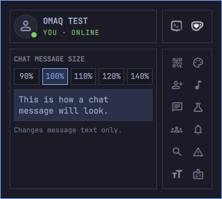</a><br>Choose 90%, 100%, 110%, 120%, or 140% and review the live preview. The same step scales message bodies and text typed in the composer.</td>
<td><a href="images/guide/08-panel-themes.png">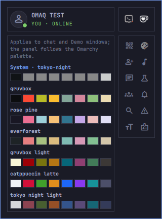</a><br>Select the system palette or a bundled chat palette. The panel itself continues to follow Omarchy.</td>
<td><a href="images/guide/09-panel-sounds.png">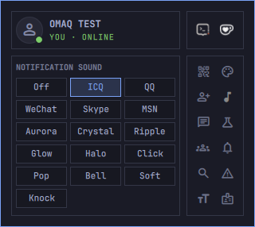</a><br>Preview a notification sound, choose Off, or import a bounded PCM WAV file. Removing a custom entry deletes only OmaQ's managed copy; the source file and bundled sounds remain unchanged.</td>
<td><a href="images/guide/35-demo-window.png">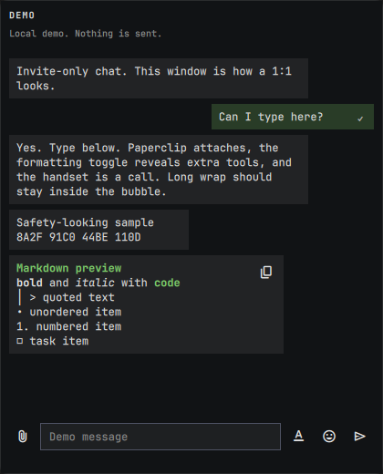</a><br>Test messages, formatting, wrapping, and the composer locally. Demo sends nothing.</td>
</tr></tbody>
</table>

Select **Chat message size**, **Theme**, or **Sounds** in the action rail before choosing an option. The global **Mute** state does not disable unread counts, delivery, encryption, or incoming-call progress tones. Per-conversation **Auto-off** disables automatic opening for that conversation and changes to **Auto-open** so you can enable it again.

Omarchy plugin settings also control badges, right-side notifications, desktop notifications, separate or bundled cards, unread animation, the default theme, message scale, sound, and formatting-toolbar visibility.

## Send DirectChat messages

DirectChat binds its window, history, unread state, files, Ratchet state, and preferences to the contact's stable public key. A reused temporary Tox friend number cannot redirect an existing chat surface or operation. When a DirectChat or GroupChat window is floating, drag the handle in its top toolbar to move it with the pointer. The handle is disabled during initial placement and while the window is tiled, and it does not overlap message selection or toolbar buttons.

<table>
<thead><tr><th>DirectChat</th><th>Formatting tools</th><th>Emoji picker</th><th>Clear chat</th></tr></thead>
<tbody><tr>
<td><a href="images/guide/15-direct-chat-overview.png">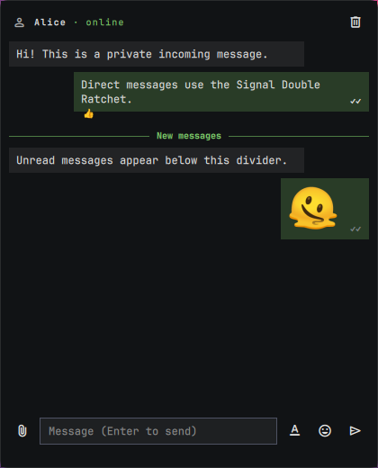</a><br>The header keeps the contact name beside online, offline, reconnecting, or typing state. The history shows incoming and outgoing bubbles, receipts, reactions, and unread separation.</td>
<td><a href="images/guide/16-direct-formatting.png"></a><br>Toggle Heading, Bold, Italic, Quote, Code, Link, unordered list, numbered list, and task list tools.</td>
<td><a href="images/guide/17-direct-emoji-picker.png">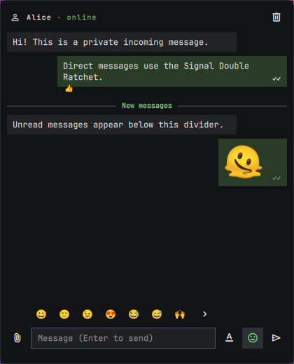</a><br>Scroll through the picker or paste another valid Unicode emoji sequence. Emoji-only messages use the fixed 56-pixel presentation. A message's React action shows the five most-used reactions in the loaded conversation at the same size as this picker.</td>
<td><a href="images/guide/21-direct-clear-confirm.png">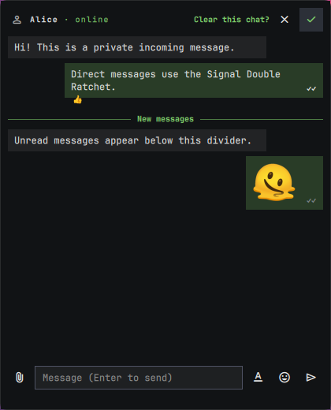</a><br>Clear requires confirmation and removes only the current local conversation history.</td>
</tr></tbody>
</table>

Press unmodified `Enter` or the Send action to send. Use `Shift+Enter`, `Ctrl+Enter`, `Alt+Enter`, or `Meta+Enter` for a line break. Text paste remains available while the helper reconnects or lacks image capability.

Hover or keyboard-focus a message to react, use inline Reply, edit your own message, copy it, or request confirmed deletion. Message text supports pointer and keyboard selection; the selection Copy action appears only for a non-empty selection and copies exactly that text. A failed pre-delivery message stays visible with a safe Resend action. A message that may already have reached transport reports an unknown result and does not offer automatic resend.

Direct receipt markers remain monotonic:

- `·`: sending
- `✓`: sent
- `✓✓`: delivered
- `✓✓` in `color03`: read

Delayed events never change Read back to Delivered or Sent. The **New messages** divider marks the first unread message loaded from helper-authoritative history.

## Exchange files and images

DirectChat uses Tox friend-file transfers. Incoming files remain paused until the recipient accepts them, and the default download directory is `~/Downloads/omaq/`.

<table>
<thead><tr><th>Select a file</th><th>Accept a file</th><th>Preview an image</th><th>File actions</th></tr></thead>
<tbody><tr>
<td><a href="images/guide/18-direct-file-picker.png">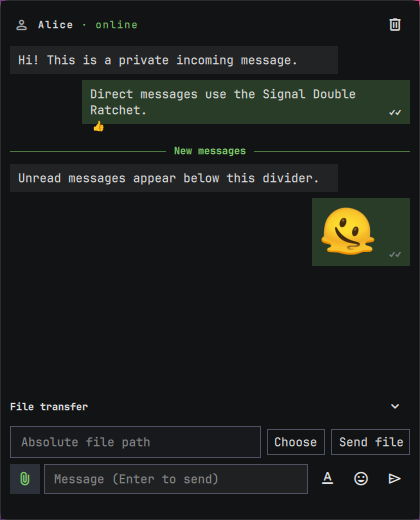</a><br>Choose a file or enter an absolute path, then select Send file. An active outgoing transfer can be canceled.</td>
<td><a href="images/guide/19-direct-file-offer.png">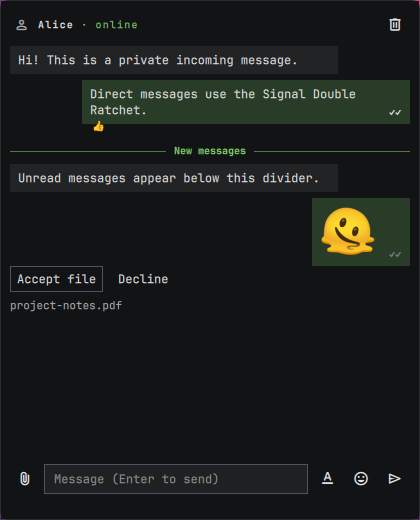</a><br>The recipient explicitly accepts or declines the named file before bytes are written.</td>
<td><a href="images/guide/20-direct-image-preview.png">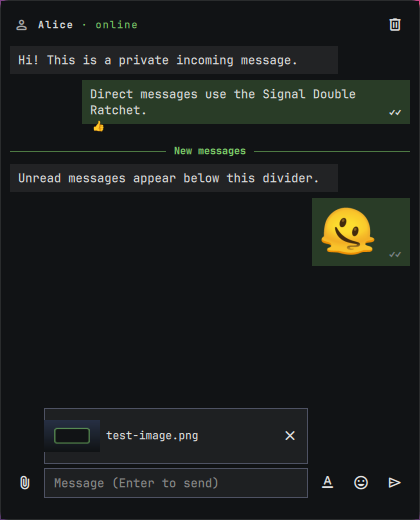</a><br>Selected, dropped, or pasted PNG, JPEG, and WebP images receive a private helper-validated preview before sending.</td>
<td><a href="images/guide/36-direct-file-history.png">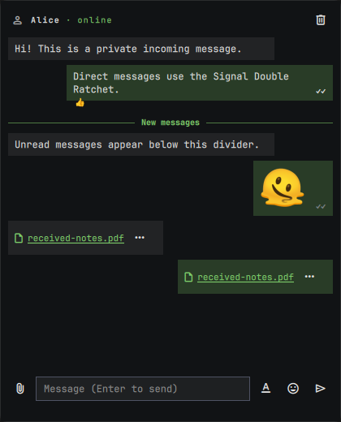</a><br>Completed files keep a local path. Open its containing folder or copy the full path from the OmaQ context menu.</td>
</tr></tbody>
</table>

Image bubbles use a 56×56 preview and open the complete local file when selected. OmaQ fully decodes and canonically rewrites incoming images before displaying them. Video files remain ordinary downloads without inline previews, while received audio files provide Play and Pause controls.

The helper limits attachments to 8 MiB, rejects symlink destinations, and writes accepted downloads with private permissions. Override the destination with `OMAQ_DOWNLOAD_DIR` or `XDG_DOWNLOAD_DIR`.

## Make DirectChat voice calls

VoiceCall is available only in DirectChat. The bar icon pulses while a call rings, and one process-wide tone owner prevents layered ringing across monitors.

Select the call action to ring a contact. The recipient can Answer, Decline, or Hang up while ringing. An active call shows elapsed time and retains Hang up.

OmaQ captures and plays 48 kHz mono audio through the PulseAudio client library. PipeWire-Pulse supplies desktop devices. OmaQ keeps call audio in bounded memory and does not record it.

## Create and manage private groups

Private Tox New Group Chats (NGC) support up to 10 members. Group identity, membership, roles, unread state, messages, and attachments remain helper-authoritative.

Create and open a group in this order:

1. Select **Groups** in the action rail.
2. Enter a group name and select **Create**.
3. Select the named group and choose **Open**.
4. Select **Add member** in GroupChat, or choose an absent contact in the Groups panel.
5. Confirm **Invite** and wait for that contact to accept the private group invitation.

<table>
<thead><tr><th>Groups panel</th><th>GroupChat</th><th>Member list</th><th>Add a member</th></tr></thead>
<tbody><tr>
<td><a href="images/guide/11-panel-groups.png">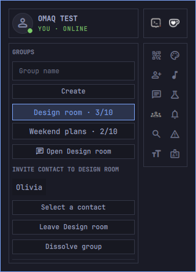</a><br>Create a named group, select it, open it, invite an absent contact, leave it, or dissolve it when you are the owner.</td>
<td><a href="images/guide/22-group-chat-overview.png">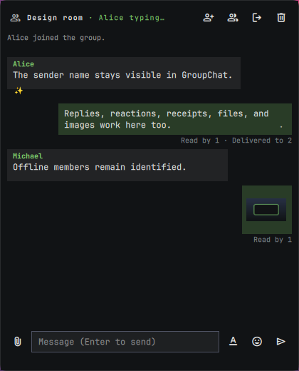</a><br>GroupChat shows sender names, member typing, reactions, system messages, member-aware receipts, files, images, and the shared composer. Calls are intentionally absent.</td>
<td><a href="images/guide/23-group-members.png">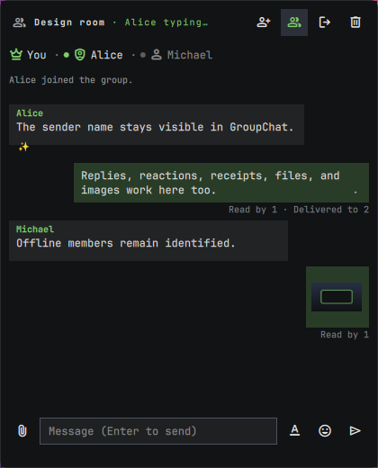</a><br>The strip shows You, owner/admin/member roles, and filled online or muted offline presence indicators.</td>
<td><a href="images/guide/24-group-add-member.png">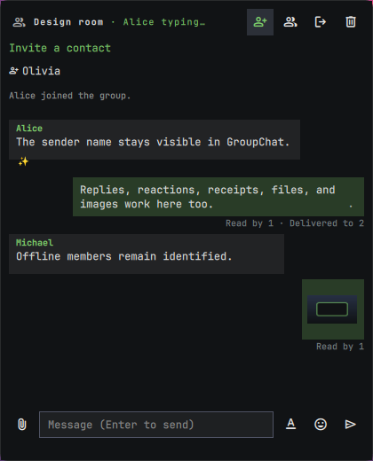</a><br>Owners and admins select a contact who is not already present, then send a request-correlated invitation.</td>
</tr></tbody>
</table>

<table>
<thead><tr><th>Group file offer</th><th>Leave GroupChat</th><th>Leave from panel</th><th>Dissolve group</th></tr></thead>
<tbody><tr>
<td><a href="images/guide/25-group-file-offer.png">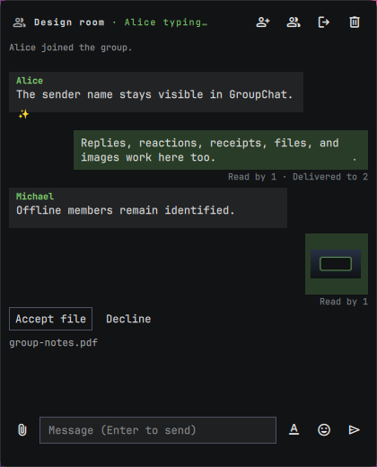</a><br>Each online member accepts or declines independently. Offline members do not receive an old attachment after reconnecting.</td>
<td><a href="images/guide/26-group-leave-confirm.png">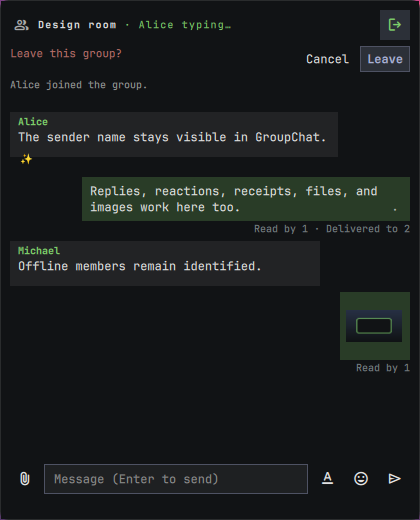</a><br>Every role can request confirmed leave from the GroupChat header.</td>
<td><a href="images/guide/30-panel-group-leave-confirm.png">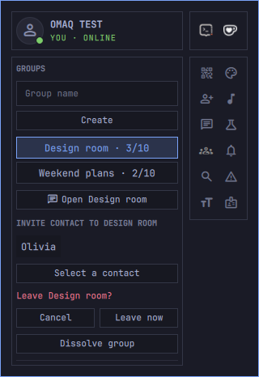</a><br>The Groups panel binds confirmation to the exact selected group.</td>
<td><a href="images/guide/31-panel-group-dissolve-confirm.png">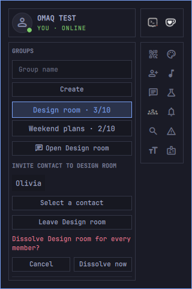</a><br>Only the owner can dissolve the selected group for every member.</td>
</tr></tbody>
</table>

Click or keyboard-open another member to review presence and available moderation actions. Owners can promote a member to admin or return an admin to member. Owners and admins can remove members according to role policy, and every moderation change requires confirmation.

Group messages support the same formatting, arbitrary emoji-only presentation, replies, editing, confirmed deletion, reactions, unread divider, and image workflow as DirectChat. Typing names use stable group member keys. Outgoing receipts summarize exact member state, such as **Read by 1** or **Read by 1 · Delivered to 2**.

Tox NGC has no native group file primitive. OmaQ broadcasts only bounded offer metadata, then sends attachment bytes privately to each online member who accepts. The helper binds every packet to the stable group, sender member key, transfer ID, exact size, and SHA-256 digest.

A Quickshell reload reconnects to the same detached Protocol-13 helper, so active private groups remain projected in the panel. A complete computer reboot or actual helper termination remains different: Tox cannot reconstruct a private NGC membership from its Chat ID alone, so another member may need to invite that identity again.

## Protect and move your identity

Your Tox identity lives at `~/.local/share/omaq/tox.save`. Protecting it encrypts the Tox savedata, but it does not encrypt Ratchet state, avatars, receipts, or JSONL history; private filesystem permissions protect those files.

Select **Identity** in the action rail. Enter a passphrase before **Protect** or **Remove lock**, and choose an explicit file path before **Export**, **Validate bundle**, or **Import identity**.

<table>
<thead><tr><th>Identity actions</th><th>Locked identity</th><th>Import confirmation</th><th>Direct recovery</th></tr></thead>
<tbody><tr>
<td><a href="images/guide/12-panel-identity.png">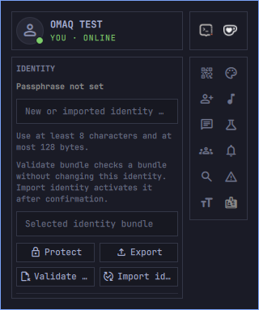</a><br>Protect or remove the lock, export a bundle, validate a selected bundle, or start separately confirmed import.</td>
<td><a href="images/guide/14-panel-locked.png">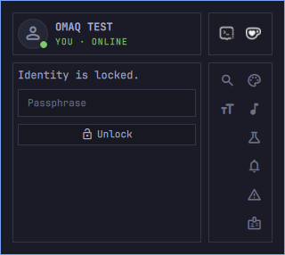</a><br>Enter the existing passphrase to unlock. Passphrases are sent only to a ready local helper and are never queued.</td>
<td><a href="images/guide/32-panel-identity-import-confirm.png">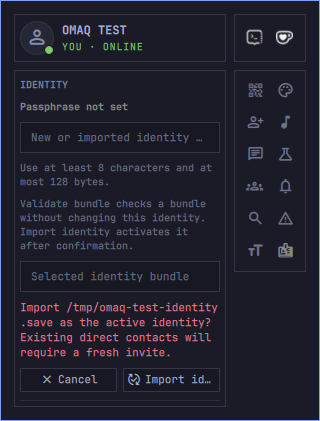</a><br>Import activates the exact validated bundle only after confirmation and restores the previous identity if replacement fails.</td>
<td><a href="images/guide/33-panel-direct-recovery.png">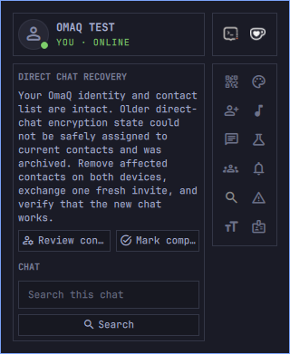</a><br>When old numeric state cannot be bound safely, OmaQ preserves identity and contacts, archives ambiguous chat state, and requests fresh invitations.</td>
</tr></tbody>
</table>

Use at least 8 Unicode characters and no more than 128 UTF-8 bytes for a new passphrase. **Validate bundle** inspects without activating. **Import identity** is a separate destructive boundary and requires **Import identity now**.

Export bundles include Tox savedata and private group mappings. They deliberately exclude Ratchet sessions, local history, avatars, receipts, and files. Transfer a bundle securely and delete extra copies.

After importing an identity with existing contacts, remove affected contacts on both devices and exchange fresh invitations before messaging. Restoring stale Double Ratchet sessions could reuse old message state, so OmaQ does not include them in identity bundles.

## Handle destructive and recovery states

Danger-zone actions bind confirmation to the selected object and never guess from a reused temporary number. Select **Danger zone** in the action rail, choose the exact contact or personal-ID action, then review the named confirmation before continuing.

<table>
<thead><tr><th>Danger zone</th><th>Remove contact</th><th>Rotate personal ID</th><th>Verify state</th></tr></thead>
<tbody><tr>
<td><a href="images/guide/13-panel-danger-zone.png">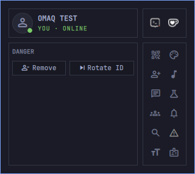</a><br>Contact removal and personal-ID rotation remain separate, explicitly confirmed operations.</td>
<td><a href="images/guide/28-panel-remove-contact-confirm.png">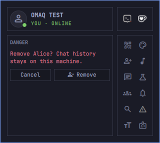</a><br>Removing a contact clears current Ratchet trust for that contact but retains local history.</td>
<td><a href="images/guide/29-panel-rotate-id-confirm.png">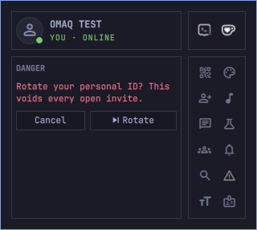</a><br>Rotation voids every open invitation and requires immediate confirmation.</td>
<td><a href="images/guide/34-panel-primary-state-warning.png">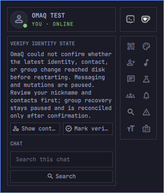</a><br>After uncertain directory durability, messaging and mutations pause until you inspect the surviving state and mark it verified.</td>
</tr></tbody>
</table>

OmaQ keeps a fingerprint-bound identity-presence record and a current recovery copy under `~/.local/state/omaq/`. If established `tox.save` disappears, the helper restores only its verified non-stale copy or stops visibly without creating a replacement identity.

A degraded recovery warning means the committed primary identity remains active, but the secondary copy could not be refreshed. OmaQ marks the old copy stale and never restores it automatically. Export a current bundle before relying on automatic recovery.

Do not delete recovery markers manually. Review the exact warning, complete the requested verification or fresh-invite workflow, then use the correlated confirmation action.

## Install and update OmaQ

Arch User Repository (AUR) packaging remains paused. Install the required packages, add the plugin, and build the local helper:

```bash
omarchy pkg add \
  toxcore libsignal-protocol-c libpulse libpng libjpeg-turbo libwebp \
  ttf-material-symbols-variable qrencode &&
omarchy plugin add \
  https://github.com/HANCORE-linux/OmaQ.git --enable &&
make -C ~/.config/omarchy/plugins/hancore.omaq helper
```

Update the source, rebuild the helper, and rescan plugins:

```bash
omarchy plugin update hancore.omaq --yes &&
make -C ~/.config/omarchy/plugins/hancore.omaq helper &&
omarchy-shell shell rescanPlugins
```

The helper is detached, so rebuilding it and rescanning QML does not replace an already running process. Protocol-14 features remain disabled until the matching helper starts through a separately controlled lifecycle or a later group-free login. This source branch has no supported in-place helper updater; never terminate a helper while it owns an active private group.

Identity, contacts, Ratchet state, history, and preferences live outside the plugin source directory and must never be copied as runtime source files.

## Uninstall and retained data

Run the verified wrapper:

```bash
~/.config/omarchy/plugins/hancore.omaq/scripts/uninstall-omaq.sh
```

The wrapper serializes removal against helper startup, prevents respawn, verifies PID, process start time, UID, exact executable inode, socket, and instance, then requests an atomic group-free shutdown. It keeps the private state lock for the complete plugin-removal command. It refuses removal while the helper owns an active private group, native and registered group state disagree, cleanup or identity loading is pending, durable state cannot be saved, the safe operation is unsupported, or its correlated acknowledgement cannot be delivered. It never uses a signal as a fallback.

Uninstall retains these locations intentionally:

- `~/.local/share/omaq/`: identity, contacts, groups, avatars, history, and Ratchet state
- `~/.local/state/omaq/`: identity guard, recovery copy, preferences, unread state, receipts, surfaces, and journals
- `~/Downloads/omaq/`: received files
- `~/.local/state/omaq-deploy-backups/`: optional deployment backups
- the exact Omarchy plugin backup path printed by the wrapper, when present
- required dependency packages and the optional `zbar` verification package

Retaining them supports reinstall and recovery. Deleting `~/.local/share/omaq/` permanently destroys the local identity and chat data. Deleting `~/Downloads/omaq/` removes received files. Inspect every exact path printed by the wrapper before any manual deletion.
