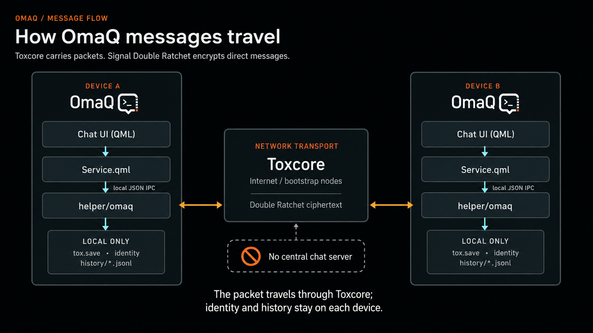
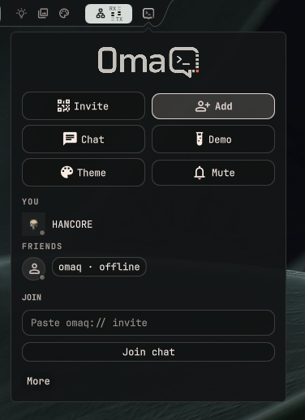
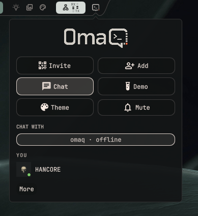
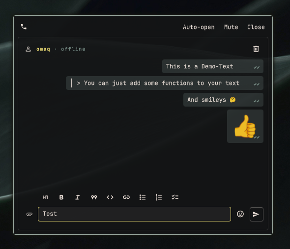
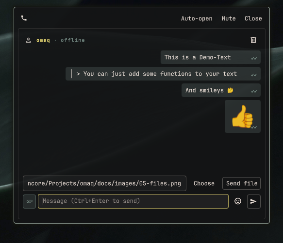
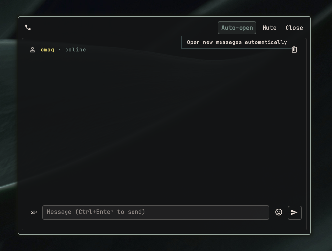
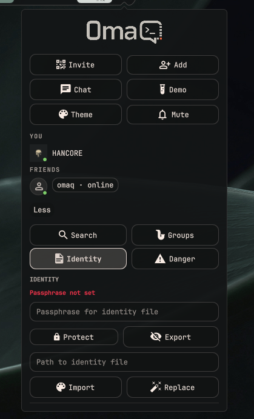

# OmaQ User Guide

A short, visual guide. Follow the steps in order and use the labels shown in the screenshots.

To begin, you need a private `omaq://` invite from the other person.

## How messages travel

- The chat UI sends through `Service.qml` to the local `helper/omaq` process.
- Toxcore transports the packet between devices.
- Direct message content is protected by the Signal Double Ratchet.
- The identity and chat history remain local; there is no central chat server.

## 1. Join and accept

1. Open OmaQ.
2. Click **Add**.
3. Paste the complete `omaq://` invite into **Paste omaq:// invite**.
4. Click **Join chat**.
5. The other person uses the pending-request controls beside `YOU · <STATE>` in the fixed panel header to accept or decline.

The invite and the explicit **Accept** step are the trust decision. Confirm the person through another trusted channel. A new link expires exactly 24 hours after the helper issues it; closing the panel, restarting the helper, or reconnecting does not restart that lifetime. The Invite view derives its countdown from the helper-issued absolute expiry. If a link was shared with the wrong person, use **Revoke** to invalidate it or **New link** to revoke it and create a replacement; both actions require confirmation, and New link completes the old revocation before creating its replacement. Revocation cannot undo an invitation that was already accepted—remove that contact separately if necessary. For an existing direct contact, **Show safety code** displays an identity code: compare it with that contact over a trusted channel. Matching codes verify that both sides selected the same two Tox identities.

## 2. Open a chat

1. Click **Chat**.
2. Click the accepted friend.
3. The chat window opens floating, without a window animation.

Close the OmaQ panel with the visible header Close action or `Escape`. Clicking outside may also close it when focus transfers to another window, without placing an invisible input surface over the desktop.

Your own panel nickname can contain up to 18 valid characters. It appears with your avatar in the compact fixed panel header. Friends and groups begin immediately at the top of the lower-left frame; longer remote or legacy panel names are shortened visually with an ellipsis and never cross the border. Every rail menu remains inside that same thin left frame. Friend names switch to `color03` on pointer hover or keyboard focus. The two borderless support glyphs above the right rail use the same size and spacing as the rail icons below, open the OmaQ GitHub repository and HANCORE's Ko-fi page, and change to `color03` on pointer hover or keyboard focus.

## 3. Chat controls

1. Move the pointer into the message field or focus it with the keyboard, then type.
2. Press **Send** or unmodified `Enter`. Use `Shift+Enter`, `Ctrl+Enter`, `Alt+Enter`, or `Meta+Enter` to insert a line break.
3. The formatting toolbar is hidden by default. Use the formatting toggle immediately left of the emoji button to show or hide it. OmaQ saves this preference globally instead of resetting it for each chat window.
4. Hover over a direct message to use the compact reaction controls beside it. Applied reactions overlap the message's lower-left edge without covering its contents.
5. Hover over your own message and click the edit icon, or select it with the keyboard and press `E`.
6. The right-click menu provides **Copy**, **Reply**, and confirmed **Delete** actions.
7. A message that could not be delivered stays visible with an error marker. Use its **Resend** action, or select it with the keyboard and press `R` or `Enter`.
8. Receipt markers use the active system palette: `·` in the foreground while sending, `✓` in `color05` when sent, `✓✓` in `color04` when delivered, and unframed `✓✓` in `color03` when read. Hover a marker for its text status. A delayed or replayed delivery event never changes an already-read marker back to Delivered or Sent.
9. Use the `format_size` panel action to preview and set chat-message text to `90%`, `100%`, `110%`, `120%`, or `140%`. Composer, controls, receipts, and member labels keep their normal size.

Direct messages use the Signal Double Ratchet. OmaQ does not use plaintext fallback.

## 4. Send files

1. Click the file icon to expand **File transfer**.
2. Click **Choose**, or enter an **Absolute file path**.
3. Click **Send file**. Collapse the section with its arrow or use **Cancel** to stop an active outgoing transfer.
4. A completed transfer keeps its success message and local file path visible until dismissed or replaced by the next file action.
5. The recipient chooses **Accept** or **Decline**. Canceling or declining a normal file leaves a **File transfer canceled** status with a close action in both chats until each user dismisses it.
6. Accepted files are stored in `~/Downloads/omaq/` by default.
7. Received audio files provide an in-chat Play/Pause control.
8. PNG, JPEG, and WebP files selected, dropped, or pasted into a direct or group chat appear as a 56×56 preview in the composer and message history. Click the preview to open the complete local image. Direct attachments use the encrypted Tox friend-file path. Group attachments announce only bounded metadata to the group and send bytes through lossless private NGC packets to each online member who explicitly accepts. The receiver verifies the exact group sender, transfer ID, size, and SHA-256 digest, then canonically rewrites an image before QML displays it. Clipboard staging remains private and is discarded if it is canceled or abandoned before sending.
9. Video previews are not shown; videos remain ordinary downloadable files.

The download directory can be changed with `OMAQ_DOWNLOAD_DIR` or `XDG_DOWNLOAD_DIR`.

## 5. Notifications

- **Auto-off** disables automatic opening for the current contact; the action then changes to **Auto-open** so it can be enabled again.
- Open **Settings** for **Mute**, **Demo**, **Theme**, and **Sounds**.
- **Sounds** offers short notification presets and previews the selected sound.
- **Mute** changes sound only and does not disable unread badges, unread state, encryption, or delivery.
- **Connecting…** or **Reconnecting…** is shown while the local helper is establishing service.
- The new-message widget badge uses palette `color01`. Unread entries for unavailable contacts or groups are removed after the authoritative registries load.

Unread messages are marked in the chat with a **New messages** divider.

Direct window and Auto-open preferences are bound to the contact's stable public key. On the first Protocol-11 update, OmaQ archives ambiguous numeric window and Auto-open records instead of assigning them to whoever currently holds that temporary friend number. An affected pinned direct window may need to be opened once from the current Friends list. Legacy Direct Auto-open entries are disabled conservatively; use **Auto-open** in each intended chat to enable them again. Group preferences remain unchanged.

## 6. Voice calls

Voice calls are available only in direct chats.

1. Use the call button in a direct chat to ring the contact.
2. An incoming call changes the OmaQ bar widget to a pulsing call icon using system palette `color01`. Clicking it opens the caller's chat but never answers automatically.
3. Choose **Answer** or **Decline**. **Hang up** remains available while ringing and during an active call.
4. An active call shows its elapsed time beside the call controls.

OmaQ captures and plays call audio through the `libpulse` event-loop API; PipeWire-Pulse supplies the desktop audio devices. Call audio stays in bounded memory and is not recorded.

## 7. Groups

Groups are private and limited to 10 members.

1. Open **Advanced** → **Groups**.
2. Enter a name in the full-width field and choose **Create** below it.
3. Select a named group, choose a contact, then use **Invite Contact**. You can also use the **Add member** icon directly in the group-chat header, where contacts already present in the group are excluded. The UI first shows that the invitation is sending, then keeps **Invitation sent · waiting for acceptance** visible after the helper confirms delivery. Internal identifiers such as `g0` are not shown as group names.
4. Use **Open** to enter the selected group chat, or use the confirmed **Leave** action for that named group.
5. The member strip in a group chat shows every cached member's name, role, and online/offline status at the normal composer text size.
6. Click or right-click a member for role-aware **Make admin**, **Make member**, and **Remove member** actions. Each moderation change requires confirmation. A removed member may receive and accept a later fresh invite.

Group chats support message formatting, emoji insertion, replies, editing, deletion, reactions, unread state, read receipts, files, and 56×56 image previews from selection, paste, or drag-and-drop. Incoming bubbles widen as needed to show the complete cached sender name, and persisted system rows name members who join or leave. The member strip uses plain, middle-dot-separated status entries: your entry is `You` with a full-size role icon, while other members show a green or gray presence dot, role icon, and name. The member menu repeats that presence with a filled green online dot. Owners and admins select an absent contact and confirm **Invite** through the same helper-authoritative path used by the panel. Every role can leave from the `logout` action in the group-chat header after confirmation. Calls are intentionally unavailable.

Tox NGC has no native group file primitive. OmaQ therefore offers a file to the group through a versioned helper envelope and transfers its bytes privately only to currently online members who accept. Offline members and older helpers do not receive that attachment retroactively; send it again after they update or reconnect.

## 8. Protect and move your identity

Your OmaQ identity is local. The private identity is not stored on a central chat server.

1. Open **Advanced** → **Identity**.
2. Enter a new passphrase with at least 8 characters and at most 128 UTF-8 bytes.
3. Click **Protect**.
4. Use **Export** and choose where to save the private identity bundle.
5. Move that file securely to the new computer.
6. Open **Advanced** → **Identity** there and use **Validate bundle** to select and check the bundle without changing the active identity.
7. If the imported identity is encrypted, enter its passphrase first. Use **Import identity** only when intentionally activating the selected identity, then confirm **Import identity now**. OmaQ validates a staged copy, creates a unique recovery backup, and restores the current identity if replacement fails.

The identity file is stored locally at `~/.local/share/omaq/tox.save`. Export creates a versioned bundle containing that saved identity and its private group mappings. Finish any active group invitation or member-binding confirmation before exporting; OmaQ reports `busy` rather than creating an incomplete bundle. The passphrase encrypts only the Tox identity data. Ratchet keys and sessions, group metadata, avatars, receipts, and chat history remain protected by private filesystem permissions rather than that passphrase.

Never send the identity bundle through a public channel. Transfer it securely and delete extra copies. Tox does not restore a missing private-group membership from a Chat ID; OmaQ reports and removes such orphaned mappings instead of fabricating a public join, so another member may need to invite the imported identity again. Ratchet state is deliberately not placed in an export bundle because restoring stale Double Ratchet sessions could reuse old message state. After **Import identity**, existing direct contacts must remove each other on both sides and exchange a fresh invite before messaging; contact removal clears the old Ratchet trust state but retains local history.

Direct-chat storage is bound to each contact's stable Tox public key rather than its temporary numeric friend number. If an older numeric state has no durable binding proof, OmaQ archives it instead of assigning it to the contact currently holding that number. Your OmaQ identity and Tox contact list remain intact. The panel shows a dedicated **Direct chat recovery** card and asks you to remove affected contacts on both devices, exchange one fresh invite, and verify the new chat. The same recovery state follows **Import identity** when it restores existing Tox contacts without their Ratchet state. After reviewing any archived `legacy-direct` data and completing the fresh invitations, use **Mark complete** and confirm **Clear warning**. The helper then durably removes its own recovery marker; do not delete private state files manually.

OmaQ also keeps a private identity-presence record and a current recovery copy under `~/.local/state/omaq/`. Normal source updates never replace `tox.save`. If an established primary identity is unexpectedly missing, the helper restores its own recovery copy; if no verified recovery copy exists, it stops before creating a replacement identity and reports the recovery problem. A confirmed **Import identity** can repair this stopped state only when the selected bundle contains the exact protected public identity; a foreign bundle is rejected. The recovery copy has the same passphrase protection as `tox.save` when identity protection is enabled. If OmaQ reports that recovery is degraded, the primary identity and contacts remain committed, but the additional copy could not be refreshed. OmaQ marks that older copy as stale and will not restore it; export an identity bundle before relying on automatic recovery. If OmaQ could not confirm primary-directory durability, it restarts fail-closed and keeps a verification card visible. Messaging, contact/group changes, and background Tox processing remain paused. Check whether the intended nickname, protection, or contact change is present before selecting **Mark verified**; do not repeat the operation first. OmaQ then reconciles any interrupted contact journal against the state that actually survived rather than replaying an uncommitted removal.

## 9. Uninstall and retained data

Run `~/.config/omarchy/plugins/hancore.omaq/scripts/uninstall-omaq.sh` to unload and remove the plugin while printing the data locations that remain. Before removal, the wrapper prevents respawn, verifies the exact running helper instance, requests a clean shutdown, and uses SIGTERM only as a verified fallback. It refuses removal if it cannot safely distinguish the helper from another process. Omarchy deletes a Git-managed plugin folder, including local modifications inside it, while a plain plugin folder is moved to the exact hidden backup path printed by the wrapper. Uninstalling does not delete `~/.local/share/omaq/`, `~/.local/state/omaq/`, `~/Downloads/omaq/`, optional `~/.local/state/omaq-deploy-backups/`, or the dependency packages `toxcore`, `libsignal-protocol-c`, `libpulse`, `libpng`, `libjpeg-turbo`, `libwebp`, `ttf-material-symbols-variable`, and `qrencode`; the optional verification tool `zbar` also remains when installed for testing.

Retaining these locations protects your identity, Ratchet state, groups, history, preferences, receipts, and downloaded files if you reinstall. The wrapper prints independent manual commands for inspecting and permanently deleting each retained data directory and any exact plugin-backup path later. It also shows how to inspect dependency packages and remove them only when no other application needs them. Deleting `~/.local/share/omaq/` permanently destroys the local identity and chat data; deleting `~/Downloads/omaq/` removes received files. Each deletion is irreversible, so remove only data you no longer need.
